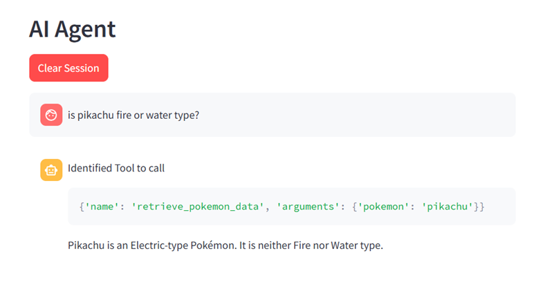
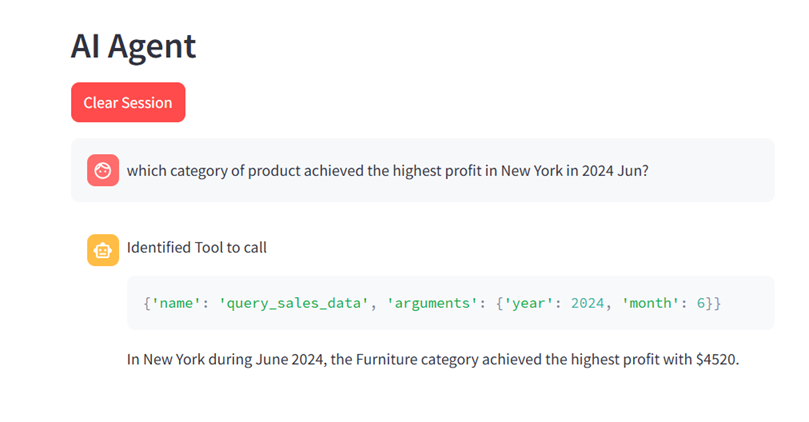

# MCP Integration with Streamlit and Google Gemini

This repository provides a boilerplate setup for integrating a Model Context Protocol (MCP) backend with a Streamlit frontend and Google Gemini API. It's designed to help you quickly prototype and test MCP tools via Streamlit as MCP client.


## 🚀 Prerequisites

Before getting started, ensure you have the following:

- Python 3.12 installed on your system
- A [Google Gemini API key](https://ai.google.dev/gemini-api/docs) [Free]

---

## 1. Environment Preparation
Copy the repository into your system
```
git clone https://github.com/Benlau93/mcp-streamlit-gemini.git
```

Create a virtual environment with Python 3.12
```
python3.12 -m venv venv
source venv/bin/activate  # On Windows: venv\Scripts\activate

```
Install dependencies
```
pip install -r requirements.txt

```
## 2. Start the MCP Backend
```
cd server
python server.py
```

## 3. Input Environment Variables
Provide environment variable
You will need 2 environment variable <br>
- API_KEY (Google Gemini API Key)
- MCP_URL (MCP URL Obtained from step 2)
Your project structure should looks like this
```
.
├── app.py                 # Streamlit frontend
├── requirements.txt       # Python dependencies
├── .streamlit/
│   └── secrets.toml       # API key and MCP config (user-provided)
├── README.md
└── ...

```

Create a secrets.toml file under .streamlit folder and enter the following:
```
API_KEY = "YOUR_API_KEY"
MCP_URL = "YOUR_MCP_URL"

```

## 4. Start Streamlit application
```
streamlit run app.py

```

<hr>

## Start using the app
Right now, 2 tools are available in the MCP as demo
1. Pokemon data retrieval that calls a Pokemon API to retrieval data on Pokemon
2. Internal Sales data retrieval that reads and compute sales statistics

### Example 1
LLM Assistant to identify and invoke the Pokemon API when asked about Pokemon.


### Example 2
LLM Assistant to identify and invoke the Sales data retrieval when queried on sales information
